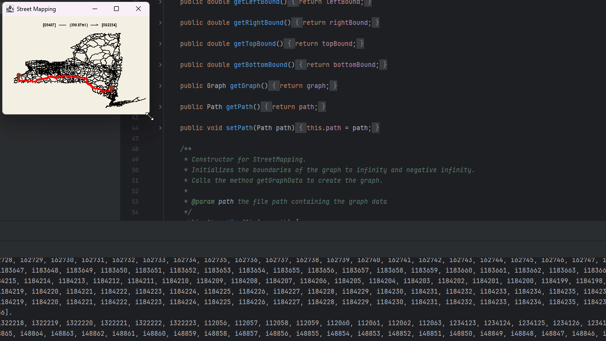

# Interactive Map Pathfinder

## Overview
Interactive Map Pathfinder is a Java-based program that visualizes street maps and allows users to find the shortest path between intersections in a geographic area. This is achieved through an implementation of Dijkstra's algorithm, displaying both the map and the calculated path on a resizable and interactive GUI. 

### Key Features:
- **Pathfinding**: Uses Dijkstra's algorithm to find the shortest path between two intersections in a graph.
- **Interactive Map**: Users can select starting and ending points for path calculations via mouse clicks.
- **Spatial Optimization**: A QuadTree structure is used to optimize spatial queries and map display, making the interface responsive to mouse events.
- **Graph Structure**: The program includes classes for managing nodes, edges, paths, and graph data structures.

## Functionality

### Classes and Methods
- **Graph**: Manages a collection of nodes and edges, and provides methods for adding nodes/edges and finding the shortest path using Dijkstra's algorithm.
- **Node and Edge**: Represent intersections and roads, respectively. Nodes store coordinates and connected edges, while edges store information about connected nodes and traversal costs.
- **Path**: Represents a sequence of edges between a start and end node.
- **QuadTree**: A data structure used to optimize spatial queries by partitioning the 2D space, making mouse-based node selection efficient.

### Mouse Controls
The program responds to various mouse interactions for intuitive map exploration and pathfinding:

- **Left Click**: Sets the starting point for the path calculation.
- **Right Click**: Sets the destination point for the path calculation.
- **Dragging with Right Button**: Sets a new starting point for the path calculation and dynamically displays the path.
- **Dragging with Left Button**: Sets a new ending point for the path calculation and dynamically displays the path.

## Input File Format
The input file must contain two types of records for intersections (nodes) and roads (edges), formatted as follows:

- **Nodes (Intersections)**: Each node entry begins with an `i`, followed by a unique ID and the latitude and longitude coordinates.
  - `i i1 39.466667 --0.375000`
- **Edges (Roads)**: Each edge entry begins with an `r`, followed by a unique ID, and the IDs of the two intersections it connects.
  - `r r1 a b`


## Compilation and Execution

To compile and run the program, use the following commands in your terminal:

1. **Compile**:
 ```shell
 javac StreetMap.java
 java StreetMap [file_name].txt [--show] [--directions] [source_id] [target_id]
 ```
`--show`: Displays the map graphically.
`--directions`: Calculates and displays directions between the specified source and target nodes.

## Graphical Map Preview
<div style="display: flex; justify-content: center; gap: 20px;">
  
  
</div>

<div style="display: flex; flex-wrap: wrap; justify-content: center; gap: 10px;">
  
  
</div>


